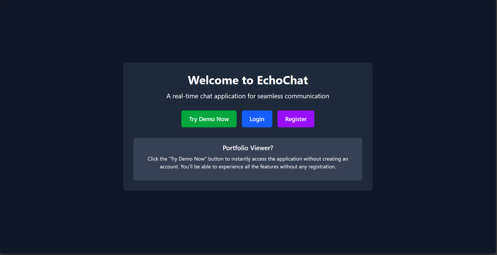
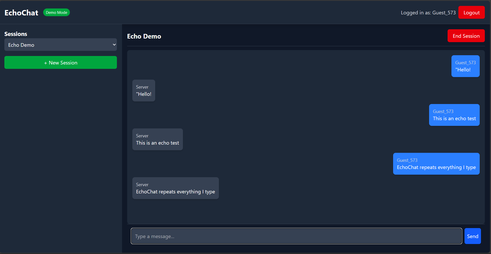

# EchoChat

A real-time chat application for seamless communication that repeats messages back to users, demonstrating instant feedback.

## Features

- Real-time message echoing
- Multiple chat sessions
- User registration and authentication
- Demo mode for visitors
- Responsive UI for all devices

## Screenshots

### Demo Landing Page

*Landing page with direct demo access for portfolio viewers*

### Chat Interface

*Chat interface showing real-time message echoing*

## Getting Started

### Prerequisites
- Node.js and npm

### Installation
1. Clone the repository
2. Install dependencies:
```bash
npm install
```
3. Start the development server:
```bash
npm run dev
```

## Demo Access

For portfolio viewers, a "Try Demo Now" button is available on the landing page that provides instant access without registration.

## Technologies Used

- React.js
- Vite
- Socket.io (for real-time communication)
- Tailwind CSS (for styling)

## Deployment

This project is deployed on Vercel. Add your VITE_BACKEND_URL to environment variables.

---

*Note: To use your own screenshots, replace the placeholder URLs with the actual image URLs after uploading.*
